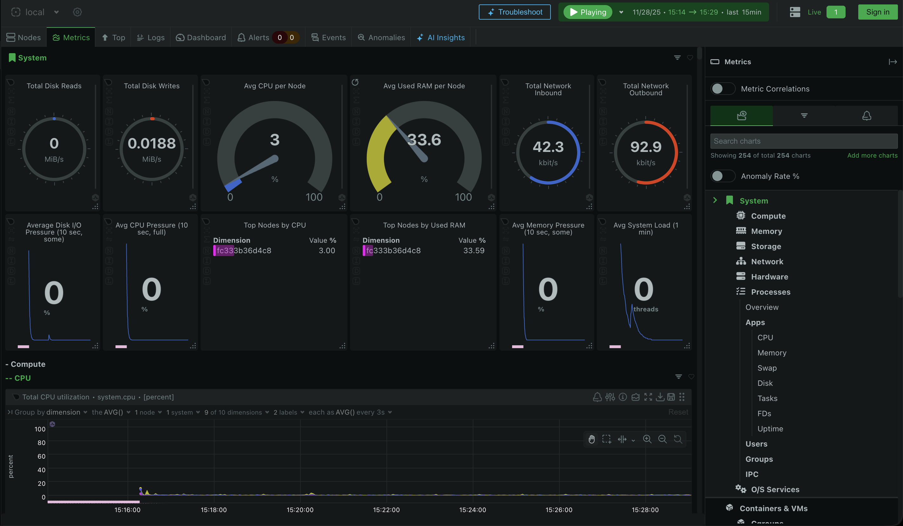

# AWS Infrastructure as Code (Terraform + Docker)


Production-ready Infrastructure as Code (IaC) project deploying a secure, scalable, and modular AWS environment using Terraform.
The project provisions a custom Virtual Private Cloud (VPC) with strict security rules, hosts a Dockerized web server, and includes an automated observability stack with Netdata.



## Architecture Overview 

```
User (Browser)
   │
   │ HTTP Request (Public IP)
   ▼
[ AWS Internet Gateway ]
   │
   ▼
[ Security Group (Firewall) ]
   │   ├── Allow: Port 80 (HTTP)
   │   └── Allow: Port 22 (SSH)
   ▼
[ EC2 Host Machine (Ubuntu 22.04) ]
   │
   │ Port Forwarding (80 -> 19999)
   ▼
[ Docker Container (Netdata) ]
   │   (Internal Port: 19999)
   │
   ├── Monitors Host CPU/RAM (via /proc volume)
   ├── Monitors Host Disks (via /sys volume)
   └── Generates Real-time Dashboard HTML
```
## Key Features

-   **Modular Design:** Infrastructure is split into reusable
    abstractions (`modules/network` and `modules/compute`).
-   **Remote State Management:** Terraform state is stored securely in
    an **S3 Bucket** with state locking enabled via **DynamoDB** to
    prevent concurrency issues.
-   **Security First:**
    -   Strict Security Groups configuration.
    -   SSH Key-Pair authentication (no passwords).
    -   Private variables are excluded from version control
        (`.gitignore`).
-   **Automated Observability:** Uses EC2 User Data to bootstrap
    **Docker** and deploy **Netdata** for real-time hardware monitoring
    (CPU, RAM, Network I/O).

## Tech Stack

-   **Infrastructure:** Terraform (HCL), AWS (VPC, EC2, S3, DynamoDB).
-   **Containerization:** Docker.
-   **Monitoring:** Netdata (Real-time infrastructure monitoring).
-   **OS:** Ubuntu 22.04 LTS (dynamically fetched via AWS AMI Data
    Source).

## Project Structure
```
    .
    ├── modules/
    │   ├── network/             # VPC, Subnets, IGW, Route Tables
    │   └── compute/             # EC2, Security Groups, Docker/Netdata bootstrapping
    ├── backend_resources.tf     # Infrastructure for the S3 Backend & DynamoDB Lock
    ├── main.tf                  # Root module orchestration
    ├── outputs.tf               # Global outputs (e.g., Server IP)
    ├── variables.tf             # Global variables declaration
    ├── versions.tf              # Provider & Backend configuration
    └── terraform.tfvars.example # Template for input variables
```

## Prerequisites

-   Terraform installed (v1.2+).
-   AWS CLI configured with valid credentials.
-   An SSH Key pair generated locally (`ssh-keygen -t ed25519`).

## Installation Guide

1.  **Clone the repository:**

``` bash
git clone https://github.com/tiltaslifestyle/aws-terraform-secure-web.git

cd aws-terraform-secure-web
```

2.  **Configure Variables:** Create a `terraform.tfvars` file based on the example:

``` bash
cp terraform.tfvars.example terraform.tfvars
```

3.  **Initialize Terraform:**

``` bash
terraform init
```

4.  **Deploy:**

``` bash
terraform plan

terraform apply
```

5.  **Accessing the Dashboard:** Terraform will output:
```bash
 website_endpoint = "http://xx.xx.xx.xx"
```

_Open it in your browser after \~2 minutes to view the Netdata Dashboard._

## Remote Backend Note

If you are deploying from scratch:

1.  Comment out the backend `s3` block in `versions.tf`.
2.  Run `terraform apply` to create S3 + DynamoDB.
3.  Uncomment backend and run `terraform init` to migrate state.

## Clean Up

``` bash
terraform destroy -target=module.compute -target=module.network
```

_(S3 bucket remains untouched to preserve state history)._
